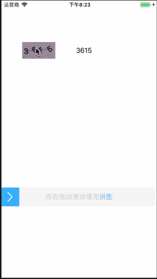

# WQVerificationView
random number verification/slide image puzzle verification

## Result


## Usage
- random number verification

```
WQVerificationCodeView *codeView = [[WQVerificationCodeView alloc] initWithFrame:CGRectMake(50, 100, 80, 40)];

NSString* userInput = ...;
if([userInput isEqualToString:[self.codeView getVerficationCodeStr]]){
	//match
};
```

- slide image puzzle verification

```
WQVerificationSliderView *sliderView = [[WQVerificationSliderView alloc]
            initWithFrame:CGRectMake(0, 450, [UIScreen mainScreen].bounds.size.width, 45)];

if(self.sliderView.validateState == VALIDATE_STATE_SUCCESS){
	//match
}
```